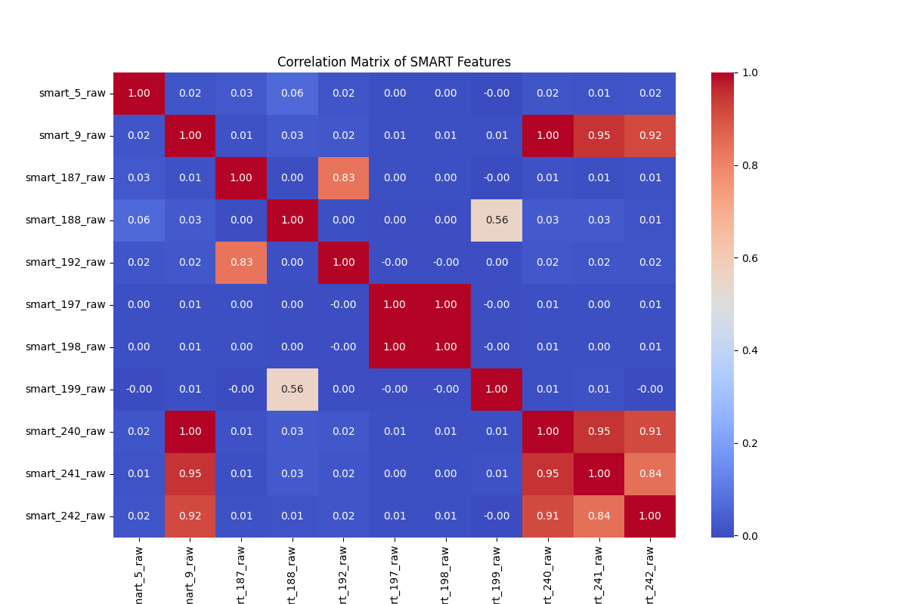
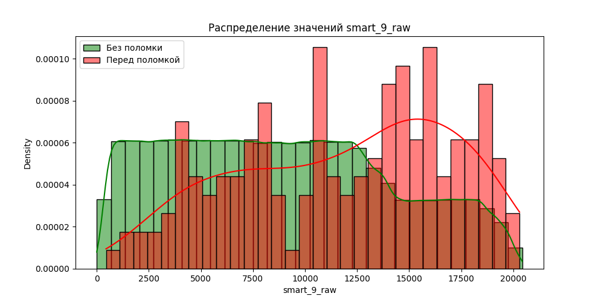
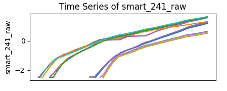
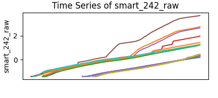

# Анализ данных

Датасет содержит информацию о 172 дисков с поломкой и 10755 дисков без поломок, всего более 7,5 млн записей. Пропуски в данных отсутствуют.

Имеются следующие полезные признаки:

1. smart_5_raw (Reallocated Sectors Count)
Количество переназначенных секторов. Указывает на сбойные сектора, замененные резервными.

2. smart_9_raw (Power-On Hours)
Общее время работы диска.

3. smart_187_raw (Reported Uncorrectable Errors)
Количество необратимых ошибок чтения/записи.

4. smart_188_raw (Command Timeout)
Количество команд, завершившихся с тайм-аутом.

5. smart_192_raw (Power-Off Retract Count)
Количество аварийных парковок головок.

6. smart_197_raw (Current Pending Sector Count)
Количество секторов, ожидающих перераспределения из-за ошибок чтения/записи.

7. smart_198_raw (Offline Uncorrectable)
Количество необратимых ошибок, обнаруженных в фоновом режиме.

8. smart_199_raw (UDMA CRC Error Count)
Количество ошибок передачи данных через интерфейс.

9. smart_240_raw (Head Flying Hours)
Время работы головок (для HDD).

10. smart_241_raw (Total LBAs Written)
Общее количество записанных данных (в логических блоках).

11. smart_242_raw (Total LBAs Read)
Общее количество прочитанных данных (в логических блоках).

### Корреляционный анализ
 

Некоторые признаки имеют сильную корреляцию, можно рассмотреть вариант удаления одного из коррелирующих

### Динамика значения smart 9 до поломки

Есть идея убрать из данных записи первых дней работы дисков, если поломки происходят после определенного времени, для того чтобы сделать данные более разнородными(многие параметры имею нулевые значения в первое время работы диска).

### Распределение значений признаков по количеству

### Анализ зависимости поломки от значения признаков

Как можно видеть на примерах поломка диска связана с критическими значениями признаков, однако имеется наложение, а значит возможно стоит рассматривать более сложные зависимости

### Анализ Временных рядов для признаков

