# Описание алгоритма

**Задача**: На основе данных мониторинга состояния дисков S.M.A.R.T. и информации о неисправностях разработать решение, позволяющее предсказать, выйдет ли из строя каждый диск в течение следующих 30 дней.

Алгоритм основывается на разделении показателей каждого диска на те, которые находятся в пределах 30 дней до отказа, и те, что не попадают в этот интервал. Таким образом, задача сводится к бинарной классификации.

Для решения задачи используется модель **XGBoost**, известная своей высокой эффективностью в задачах классификации и регрессии. Алгоритм включает этапы предобработки данных, балансировки классов, обучения модели и оценки её качества.

---

## Анализ данных

Датасет содержит информацию о 172 дисков с поломкой и 10755 дисков без поломок, всего более 7,5 млн записей. Пропуски в данных отсутствуют.

Имеются следующие полезные признаки:

1. smart_5_raw (Reallocated Sectors Count)
Количество переназначенных секторов. Указывает на сбойные сектора, замененные резервными.

2. smart_9_raw (Power-On Hours)
Общее время работы диска.

3. smart_187_raw (Reported Uncorrectable Errors)
Количество необратимых ошибок чтения/записи.

4. smart_188_raw (Command Timeout)
Количество команд, завершившихся с тайм-аутом.

5. smart_192_raw (Power-Off Retract Count)
Количество аварийных парковок головок.

6. smart_197_raw (Current Pending Sector Count)
Количество секторов, ожидающих перераспределения из-за ошибок чтения/записи.

7. smart_198_raw (Offline Uncorrectable)
Количество необратимых ошибок, обнаруженных в фоновом режиме.

8. smart_199_raw (UDMA CRC Error Count)
Количество ошибок передачи данных через интерфейс.

9. smart_240_raw (Head Flying Hours)
Время работы головок (для HDD).

10. smart_241_raw (Total LBAs Written)
Общее количество записанных данных (в логических блоках).

11. smart_242_raw (Total LBAs Read)
Общее количество прочитанных данных (в логических блоках).

### Корреляционный анализ
 
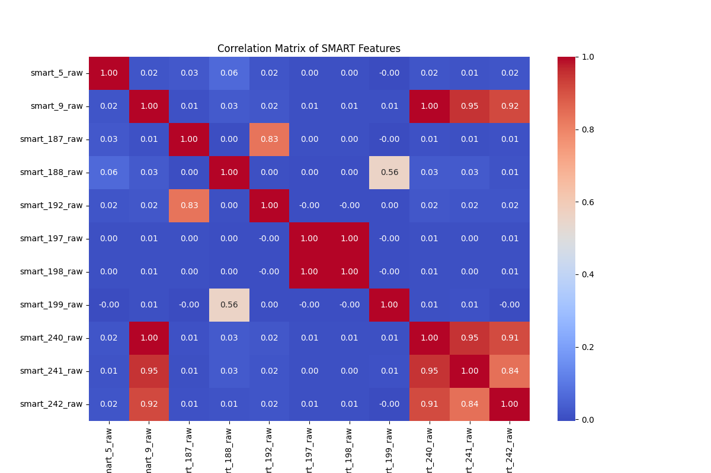

Некоторые признаки имеют сильную корреляцию, можно рассмотреть вариант удаления одного из коррелирующих

### Динамика значения smart 9 до поломки

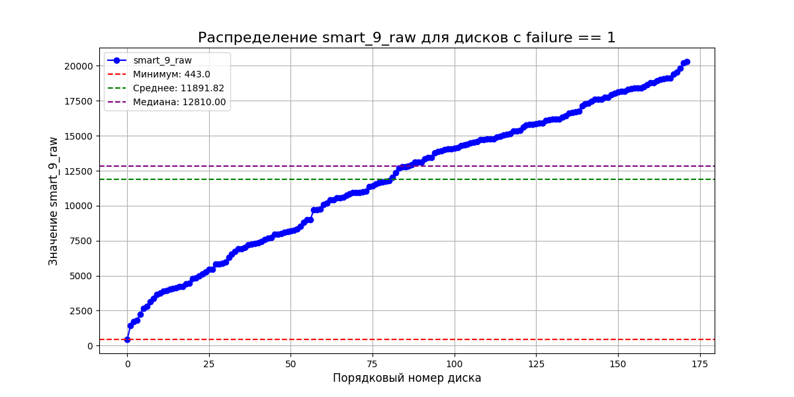

Есть идея убрать из данных записи первых дней работы дисков, если поломки происходят после определенного времени, для того чтобы сделать данные более разнородными(многие параметры имею нулевые значения в первое время работы диска).

### Распределение значений признаков по количеству

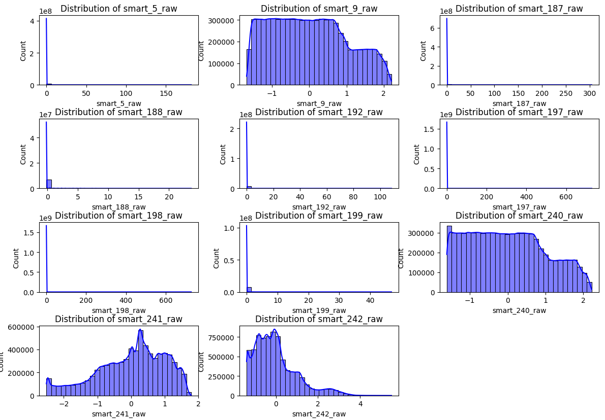

### Анализ зависимости поломки от значения признаков

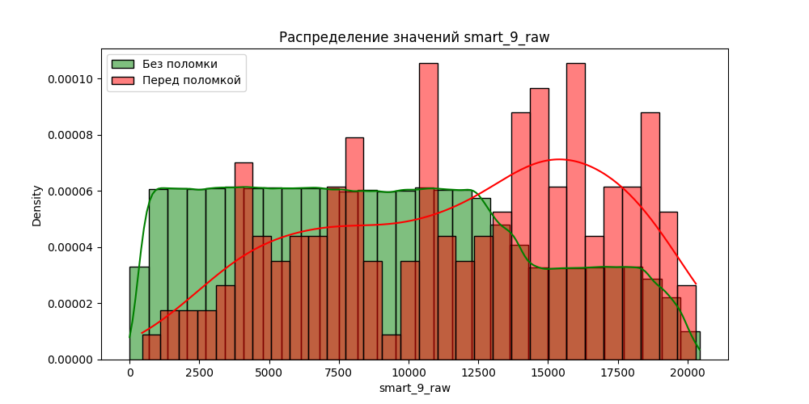
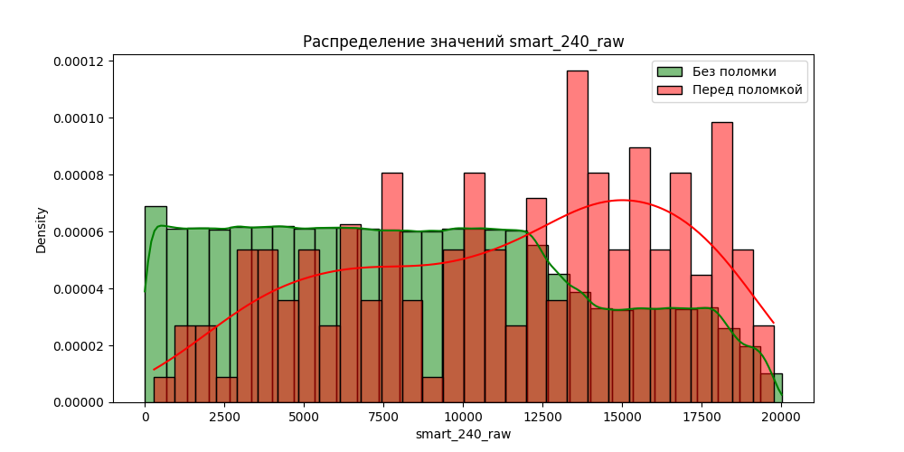
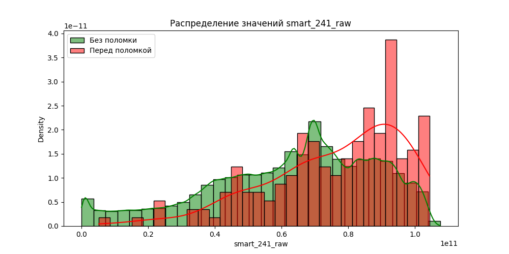

Как можно видеть на примерах поломка диска связана с критическими значениями признаков, однако имеется наложение, а значит возможно стоит рассматривать более сложные зависимости

### Анализ Временных рядов для признаков

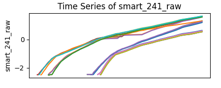
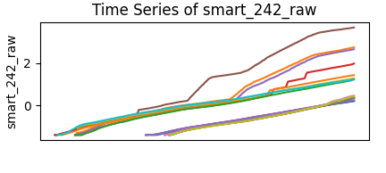
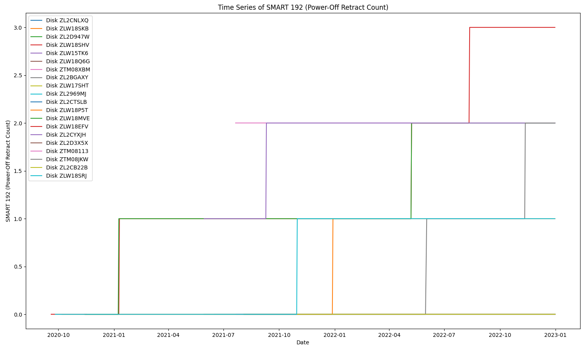

---

## Этапы алгоритма

### 1. Предобработка данных
   - **Загрузка данных**: Данные о SMART-параметрах загружаются из CSV-файла. Используются поля: дата (`date`), серийный номер (`serial_number`) и параметры SMART.
   - **Целевая переменная**: На основе даты отказа (`failure`) создается переменная `will_fail_in_30_days`, которая показывает, выйдет ли диск из строя в ближайшие 30 дней. Для дисков без отказов удаляются последние 30 дней данных.
   - **Сортировка**: Данные сортируются по серийному номеру и дате.

### 2. Добавление новых признаков
   _Для улучшения качества модели создаются дополнительные признаки на основе исходных данных:
   - **Логарифмические признаки**: Применяется логарифмирование к параметрам `smart_9_raw`, `smart_241_raw`, `smart_242_raw` для уменьшения влияния выбросов.
   - **Признаки, связанные с износом диска**: Рассчитываются средние значения записанных и прочитанных данных в час (`smart_241_raw_per_hour`, `smart_242_raw_per_hour`).
   - **Признаки, связанные с ошибками**: Вычисляются изменения параметров SMART с течением времени (`smart_5_raw_diff`, `smart_197_raw_diff`, `smart_198_raw_diff`, `smart_187_raw_diff`, `smart_188_raw_diff`).
   - **Признаки, связанные с нагрузкой на диск**: Рассчитываются соотношения между записанными и прочитанными данными (`smart_241_242_ratio`) и временем перемещения головок к общему времени работы (`smart_240_9_ratio`).
   - **Признаки, связанные с состоянием диска**: Вычисляются соотношения между переназначенными секторами и нестабильными секторами (`smart_5_197_ratio`), а также между нестабильными секторами и неисправимыми ошибками (`smart_197_198_ratio`).
   - **Признаки, связанные с ошибками CRC**: Рассчитываются изменения количества ошибок CRC (`smart_199_diff`) и их интенсивность в час (`smart_199_per_hour`).
   - **Взаимодействие признаков**: Создаются новые признаки как произведения ключевых параметров SMART (например, `smart_187_smart_197`, `smart_5_smart_197`).

### 3._ Нормализация признаков
   - Все числовые признаки нормализуются с помощью `MinMaxScaler`, чтобы привести их к единому масштабу.

### 4. Разделение данных
   - Данные делятся на обучающую, валидационную и тестовую выборки в соотношении 70:20:10. Разделение стратифицировано по целевой переменной.

### 5. Балансировка классов
   - Классы сильно несбалансированы: отказов (класс 1) намного меньше, чем исправных дисков (класс 0). Для балансировки используется **ADASYN**, который синтетически увеличивает количество примеров класса отказов.

### 6. Увеличение значимости ключевых признаков
   - Для важных признаков (`smart_5_raw`, `smart_187_raw`, `smart_192_raw`, `smart_197_raw`, `smart_198_raw`) их вес увеличивается в 5 раз.

### 7. Обучение модели
   - Используется **XGBoost** с параметрами:
     - **objective**: `binary:logistic`.
     - **eval_metric**: `logloss`.
     - **max_depth**: 9.
     - **eta**: 0.1.
     - **subsample**: 1.
     - **colsample_bytree**: 1.
     - **tree_method**: `gpu_hist`.
     - **predictor**: `gpu_predictor`.
   - Для борьбы с дисбалансом вес для класса отказов увеличен в 5 раз.

### 8. Оценка качества модели
   - Используются метрики:
     - **Accuracy** — общая точность.
     - **AUC-ROC** — способность различать классы.
     - **F1-Score** — баланс между точностью и полнотой.
     - **Confusion Matrix** — соотношение верных и ошибочных предсказаний.
   - Также строятся **ROC-кривая** и **Precision-Recall кривая**.

### 9. Сохранение модели и результатов
   - После обучения модель сохраняется для дальнейшего использования. Результаты можно экспортировать в CSV.

---

# Оценка качества модели

Модель показала следующие результаты:

### 1. Точность (Accuracy)
Общая точность модели — **99.92%**.

### 2. Площадь под ROC-кривой (AUC-ROC)
**AUC-ROC** равен **0.9985**, что говорит о высокой способности модели различать классы.

### 3. F1-Score
Для класса отказов **F1-Score** составляет **0.6456**.

### 4. Classification Report
- **Класс 0 (Неотказ)**: Точность: 1.00, Полнота: 1.00, F1-Score: 1.00.
- **Класс 1 (Отказ)**: Точность: 0.49, Полнота: 0.95, F1-Score: 0.65.

### 5. Confusion Matrix
- **Исправные диски**:
  - Правильно классифицировано: **698,701**.
  - Ошибочно классифицировано как отказавшие: **531**.
- **Отказавшие диски**:
  - Правильно классифицировано: **510**.
  - Пропущено: **29**.

---

# Визуализации

### 1. ROC-кривая
ROC-кривая демонстрирует хорошую способность модели находить баланс между ложноположительными и истинноположительными классификациями при разных порогах. 
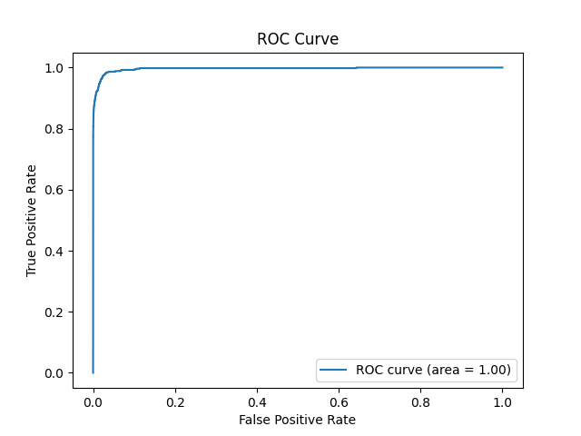

### 2. Зависимость recall от порога классификации

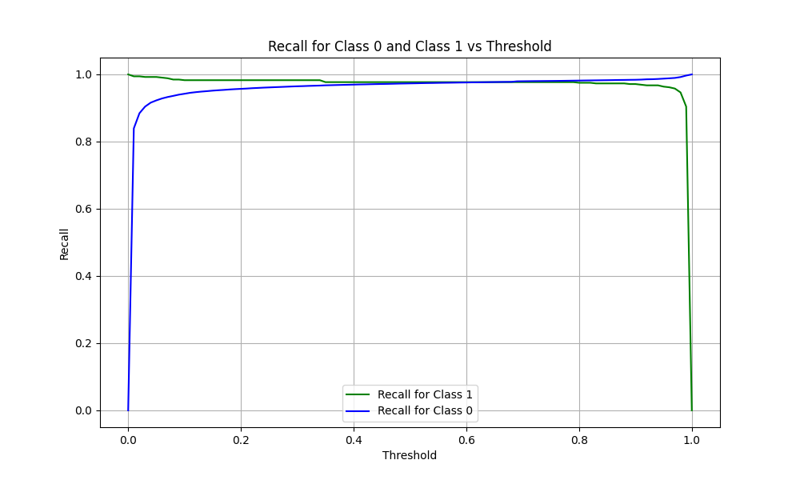

По графику можно судить что модель хорошо дифференцирует большинство примеров из обоих классов и дает им заметно отличные значения принадлежности.
---

# Заключение

Модель **XGBoost** демонстрирует высокую производительность благодаря тщательной предобработке данных, балансировке классов и оптимизации параметров. Она может помочь предотвратить потери данных и повысить надёжность систем.