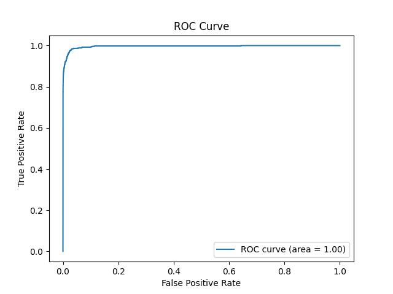
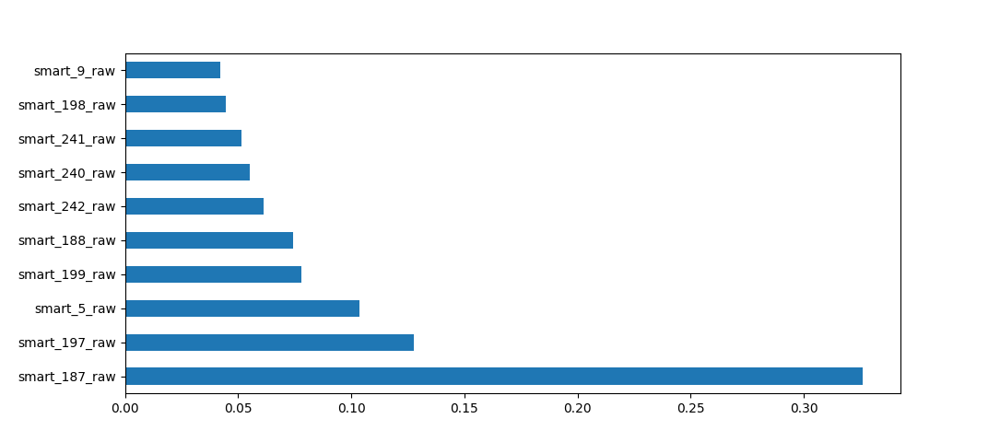

# Описание алгоритма

Основная идея поделить показатели каждого диска на те что находятся в менее 30 днях от отказа, и тех что нет. Таким образом задача сводится к бинарной классификации.

Для классификиции используется модель **XGBoost** для предсказания вероятности отказа устройств в течение ближайших 30 дней. Включает этапы предобработки данных, балансировки классов, обучения модели и оценки её качества.

## 1. Предобработка данных
   - **Загрузка и обработка данных**: Данные о SMART-параметрах загружаются из CSV-файла и преобразуются в нужный формат. При этом важные поля, такие как дата отказа и серийный номер устройства, используются для построения целевой переменной, которая указывает на то, произойдёт ли отказ в ближайшие 30 дней.
   - **Сортировка и создание целевой переменной**: Данные сортируются по серийному номеру и дате для отслеживания состояния устройства. Затем на основе даты первого отказа формируется бинарная переменная, которая будет являться целевой переменной модели.
   
## 2. Нормализация признаков
   - Признаки, относящиеся к SMART-данным (например, показатели, такие как `smart_5_raw`, `smart_9_raw`, и т. д.), нормализуются с использованием `StandardScaler` для приведения всех признаков к одному масштабу.

## 3. Балансировка классов
   - Поскольку классы в данных сильно несбалансированы (меньшинство примеров относится к отказавшим устройствам), используется метод **SMOTE (Synthetic Minority Over-sampling Technique)**. Он синтетически увеличивает количество примеров меньшинства, чтобы улучшить обучение модели.

## 4. Увеличение важности признаков
   - Для усиления роли некоторых признаков, таких как `smart_187_raw`, `smart_188_raw` и `smart_198_raw`, применяется коэффициент увеличения их значимости. Это делается с целью повышения внимания модели к этим признакам, если они обладают важным значением для предсказания отказа.

## 5. Обучение модели
   - Для обучения модели используется **XGBoost Classifier** — один из наиболее мощных методов машинного обучения для задач классификации. Модель настраивается с рядом гиперпараметров, таких как скорость обучения (`learning_rate`), количество деревьев (`n_estimators`), максимальная глубина деревьев (`max_depth`) и другие. Также используется параметр **scale_pos_weight**, чтобы компенсировать несбалансированность классов в данных.

## 6. Оценка качества модели
   - После обучения модель тестируется на отложенной выборке данных. Оценка качества проводится по нескольким меткам:
     - **Accuracy** (точность) — доля правильных предсказаний от общего числа.
     - **AUC-ROC** (площадь под кривой ROC) — оценивает способность модели различать два класса (отказ и неотказ).
     - **F1-Score** — гармоническое среднее между точностью и полнотой.
     - **Confusion Matrix** — матрица ошибок, которая отображает количество ложных положительных и ложных отрицательных предсказаний.
   - Также можно построить **ROC-кривую**, которая позволяет визуализировать компромисс между чувствительностью и специфичностью при различных порогах классификации.

## 7. Сохранение модели и результатов
   - После завершения обучения и оценки модель сохраняется для последующего использования. Кроме того, результаты предсказаний сохраняются в файл CSV для дальнейшего анализа и обработки.

---

# Оценка качества модели

**1. Точность (Accuracy)**

Точность модели составляет **96.88%**. Это означает, что модель правильно предсказала классы для 96.88% всех наблюдений в тестовой выборке.

**2. Площадь под ROC-кривой (AUC-ROC)**

Значение **AUC-ROC** модели составило **0.9962**, что указывает на отличную способность модели различать классы. Чем ближе значение AUC к 1, тем лучше модель справляется с классификацией.

**3. F1-Score**

**F1-Score** равен **0.0430**, что указывает на низкую эффективность модели в распознавании отказов (класс 1). Это низкое значение F1-Score говорит о том, что модель не очень хорошо справляется с классификацией меньшинства (отказов), что является частой проблемой при несбалансированных данных.

**4. Classification Report**

**Precision** (точность), **Recall** (полнота) и **F1-Score** для каждого класса:
- **Класс 0 (Неотказ)**: Точность — 1.00, Полнота — 0.97, F1-Score — 0.98
- **Класс 1 (Отказ)**: Точность — 0.02, Полнота — 0.98, F1-Score — 0.04

**5. Confusion Matrix**

Матрица ошибок показывает, что:
- 708,658 примеров были правильно классифицированы как "неотказ".
- 22,835 примеров были ошибочно классифицированы как "отказ", хотя они на самом деле были "неотказами".
- 513 примеров отказов были правильно классифицированы.
- 9 примеров отказов были ошибочно классифицированы как "неотказы".

---

# Визуализации

**1. ROC-кривая**

ROC-кривая показывает компромисс между ложными положительными и истинными положительными при различных порогах классификации. В данном случае площадь под кривой (AUC) составляет 0.9962, что подтверждает отличную способность модели различать классы.

**2. Важность признаков**

Диаграмма важности признаков помогает визуализировать, какие признаки сыграли наибольшую роль в принятии решений моделью. Это может помочь в дальнейшем улучшении модели, исключив маловажные признаки или, наоборот, увеличив значение более значимых.

---

# Заключение

Модель **XGBoost** показала отличные результаты по меткам **Accuracy** и **AUC-ROC**, однако **F1-Score** для класса отказов (класс 1) остался низким. Это указывает на проблему несбалансированности классов, что затрудняет точную классификацию отказов. Несмотря на это, модель достаточно хорошо выполняет задачу выявления устройств с отказами благодаря высокому значению AUC-ROC и хорошей точности по большому классу.
