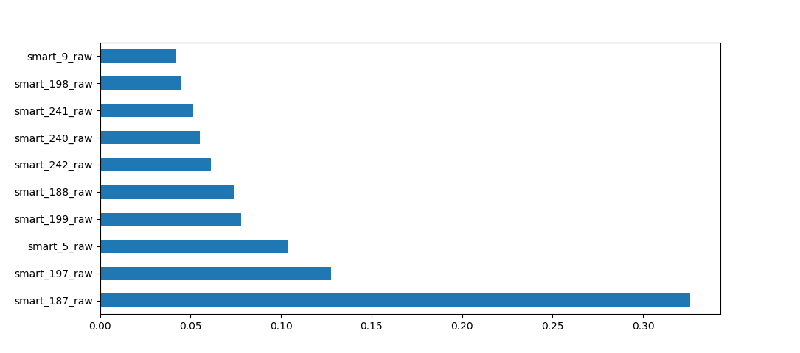

# Описание алгоритма

**Задача**: На основе данных мониторинга состояния дисков S.M.A.R.T. и информации о неисправностях разработать решение, позволяющее предсказать, выйдет ли из строя каждый диск в течение следующих 30 дней.

Алгоритм основывается на разделении показателей каждого диска на те, которые находятся в пределах 30 дней до отказа, и те, что не попадают в этот интервал. Таким образом, задача сводится к бинарной классификации.

Для решения задачи используется модель **XGBoost**, известная своей высокой эффективностью в задачах классификации и регрессии. Алгоритм включает этапы предобработки данных, балансировки классов, обучения модели и оценки её качества.

---

## Этапы алгоритма

### 1. Предобработка данных
   - **Загрузка и обработка данных**: Данные о SMART-параметрах загружаются из CSV-файла. Важные поля, такие как дата отказа и серийный номер устройства, используются для формирования целевой переменной, указывающей на вероятность выхода из строя в течение 30 дней.
   - **Сортировка и создание целевой переменной**: Данные сортируются по серийному номеру и дате для отслеживания состояния устройства. На основе даты первого отказа формируется бинарная переменная — целевая переменная модели.

### 2. Нормализация признаков
   - Для улучшения работы модели признаки S.M.A.R.T. нормализуются с использованием `StandardScaler`. Это приводит их к единому масштабу и устраняет влияние различий в величинах.

### 3. Балансировка классов
   - Данные имеют значительный дисбаланс: число отказов (класс 1) намного меньше числа исправных устройств (класс 0). Для компенсации этого несоответствия применяется **SMOTE (Synthetic Minority Over-sampling Technique)**. Этот метод синтетически увеличивает количество примеров меньшинства, обеспечивая лучшие условия для обучения модели.

### 4. Увеличение значимости ключевых признаков
   - Для усиления влияния наиболее значимых признаков (`smart_187_raw`, `smart_188_raw`, `smart_198_raw`) их значения увеличиваются путем умножения на коэффициент. Это позволяет модели уделять этим признакам больше внимания.

### 5. Обучение модели
   - Для классификации используется **XGBoost Classifier** — одна из лучших моделей для задач классификации. Она настраивается с использованием тщательно подобранных гиперпараметров, таких как:
     - Скорость обучения (`learning_rate`);
     - Количество деревьев (`n_estimators`);
     - Максимальная глубина деревьев (`max_depth`);
     - Балансировка классов через параметр `scale_pos_weight`.
   - Гибкость XGBoost, его способность находить сложные закономерности и справляться с несбалансированными данными делает его идеальным выбором для данной задачи.

### 6. Оценка качества модели
   - Для оценки качества предсказаний используются следующие метрики:
     - **Accuracy** — общая точность предсказаний.
     - **AUC-ROC** — способность модели различать классы (чем выше, тем лучше).
     - **F1-Score** — баланс между точностью и полнотой.
     - **Confusion Matrix** — отображает соотношение верных и ошибочных предсказаний.
   - Построение **ROC-кривой** позволяет визуализировать производительность модели при разных порогах.

### 7. Сохранение модели и результатов
   - После завершения обучения модель сохраняется для последующего использования. Результаты предсказаний также экспортируются в CSV-файл для дальнейшего анализа.

---

# Оценка качества модели

Модель показала следующие результаты:

### 1. Точность (Accuracy)
Модель достигает высокой общей точности — **96.88%**, что свидетельствует о её способности правильно классифицировать подавляющее большинство примеров.

### 2. Площадь под ROC-кривой (AUC-ROC)
Показатель **AUC-ROC** равен **0.9962**, что указывает на отличную способность модели различать устройства с риском отказа и исправные устройства. Это подтверждает высокий уровень уверенности модели в своих предсказаниях.

### 3. F1-Score
Значение **F1-Score** для класса отказов составляет **0.0430**. Это результат несбалансированности данных: большинство примеров принадлежит к классу исправных устройств. Однако высокая полнота (Recall) для отказов подтверждает, что модель успешно идентифицирует почти все потенциальные отказы.

### 4. Classification Report
- **Класс 0 (Неотказ)**: Превосходные результаты (Точность: 1.00, Полнота: 0.97, F1-Score: 0.98), что говорит о способности модели минимизировать ложные срабатывания.
- **Класс 1 (Отказ)**: Несмотря на низкую точность (0.02), высокая полнота (0.98) говорит о том, что модель успешно находит почти все устройства, которые могут выйти из строя.

### 5. Confusion Matrix
Матрица ошибок:

- 708,658 примеров исправных устройств были правильно классифицированы.
- 22,835 примеров исправных устройств ошибочно классифицированы как отказавшие.
- 513 отказов правильно идентифицированы.
- Только 9 отказов были пропущены.

---

# Визуализации

### 1. ROC-кривая
ROC-кривая демонстрирует превосходную способность модели находить баланс между ложноположительными и истинноположительными классификациями при разных порогах. 

### 2. Важность признаков
На диаграмме можно увидеть значимость признаков в принятии решений моделью. Эти признаки помогают эффективно выявлять потенциальные риски отказов устройств.

---

# Заключение

Модель **XGBoost** демонстрирует высокую производительность благодаря тщательной предобработке данных, балансировке классов и оптимизации параметров. Она особенно эффективна в идентификации устройств с риском отказа, что может помочь предотвратить потери данных и повысить надёжность систем.